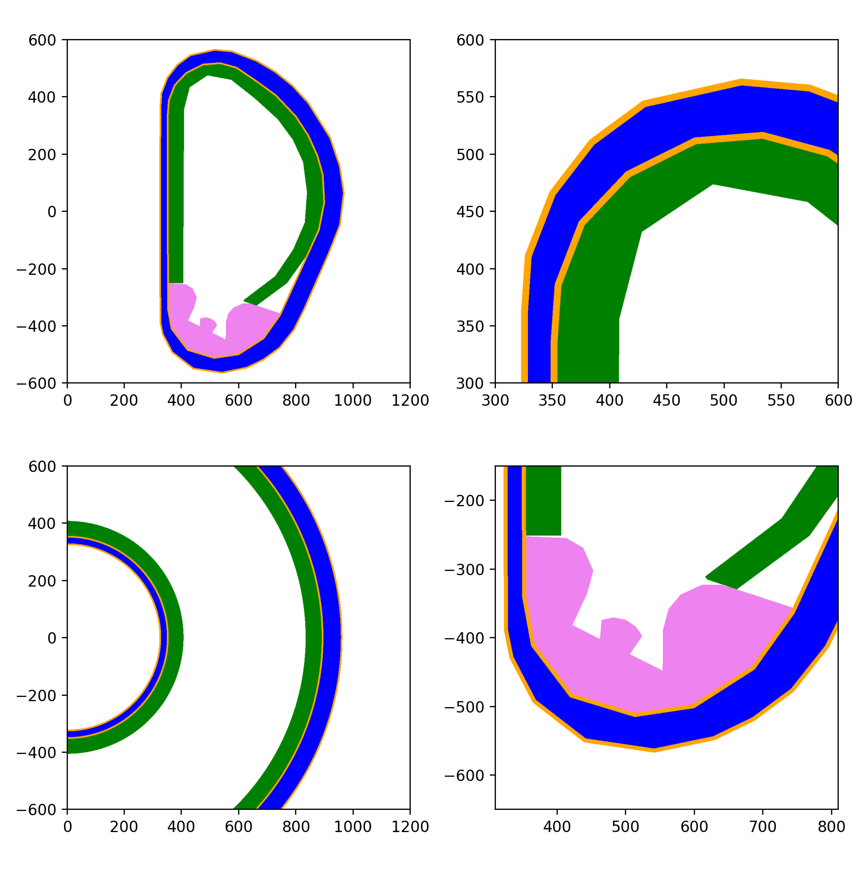

# PolygonTorus

Is a tool for creating axially symmetric CSG geometry. By revolving polygons around an axis, we get toroids -- a torus-like surface, which is a composite of conical, planar and cylindrical surfaces.

Below is an example of an ITER-like simplified model generated with PolygonTorus. This is a fully CSG model consiting of only 9 cells and 309 surfaces.

Currently it generates CSG geometry for openMC and MCNP. When generating MCNP geometry the tool can be used by itself, whereas when generating openMC geometry, openMC is used for the construction of surfaces and regions.

The tool is in its early stages:
 * There are two separate modules for openMC and MCNP inputs.
 * Code is not well documented.
 * For MCNP: The tool generates only regions. The generation of cells is made easier with the `split_into_lines()` function, but is still cumbersome.

For a theoretical explanation see `polygontorus_presentation.pdf`. For examples see `examples` folder.

## Features

**Offset():** Because of its robust definition of geometry this tool can be used for arbitrarily thin layers. When generating thick layers inside the shells (negative offset), caution should be used since vertices may get deleted.

## Known limitations

* Generation of a Polygon with many vertices in MCNP. This can result in a region definition that is too big for MCNP (MCNP 5.16 was tested).
* The `split_into_lines()` function is buggy at times.
* Supports only convex polygons. Region splitting should be implemented (also to ensure cell definitions are more simple - see 1st limitation).

## Ongoing activities

* Performance assessment of polygon torus vs. toroidal surfaces
* Better MCNP workflow

## Similar work

Recently, the creation of an axially symmetric CSG geometry from a revolved polygon defined with vertices has been achieved by multiple parties, independently:
 * [OceanNuclear](https://github.com/OceanNuclear) for [bluemira](https://github.com/Fusion-Power-Plant-Framework/bluemira.git)
 * the team at Southwestern Institute for Physics
 * others?

Ideally, this method would be incorporated into [openmc](https://github.com/openmc-dev/openmc). In the mean time I plan to develop some more features, and make it more eficently use surfaces.

A similar feature has already been implemented in openmc [openmc.model.Polygon](https://docs.openmc.org/en/v0.14.0/pythonapi/generated/openmc.model.Polygon.html). The openmc feature nicely handles non-convex polygons.
